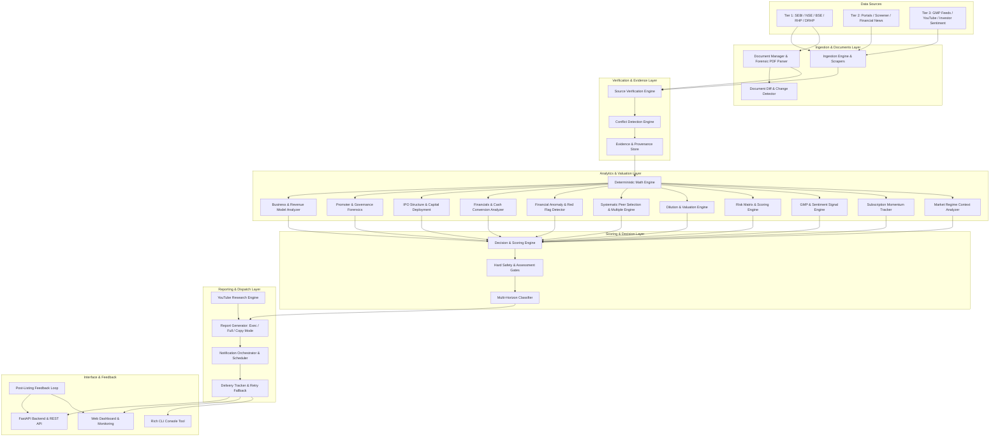
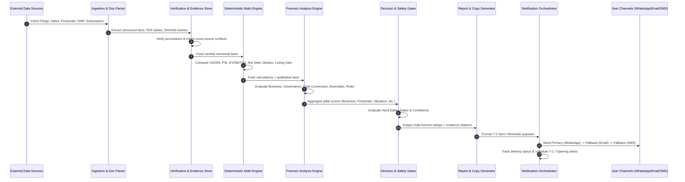
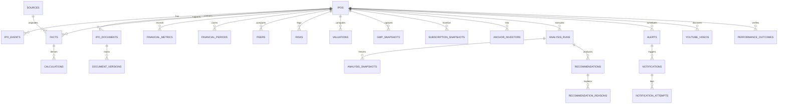
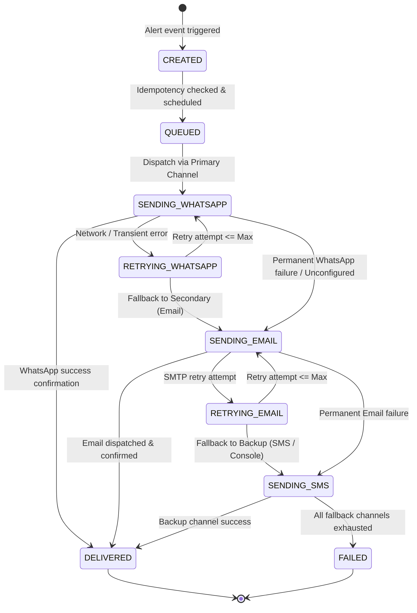
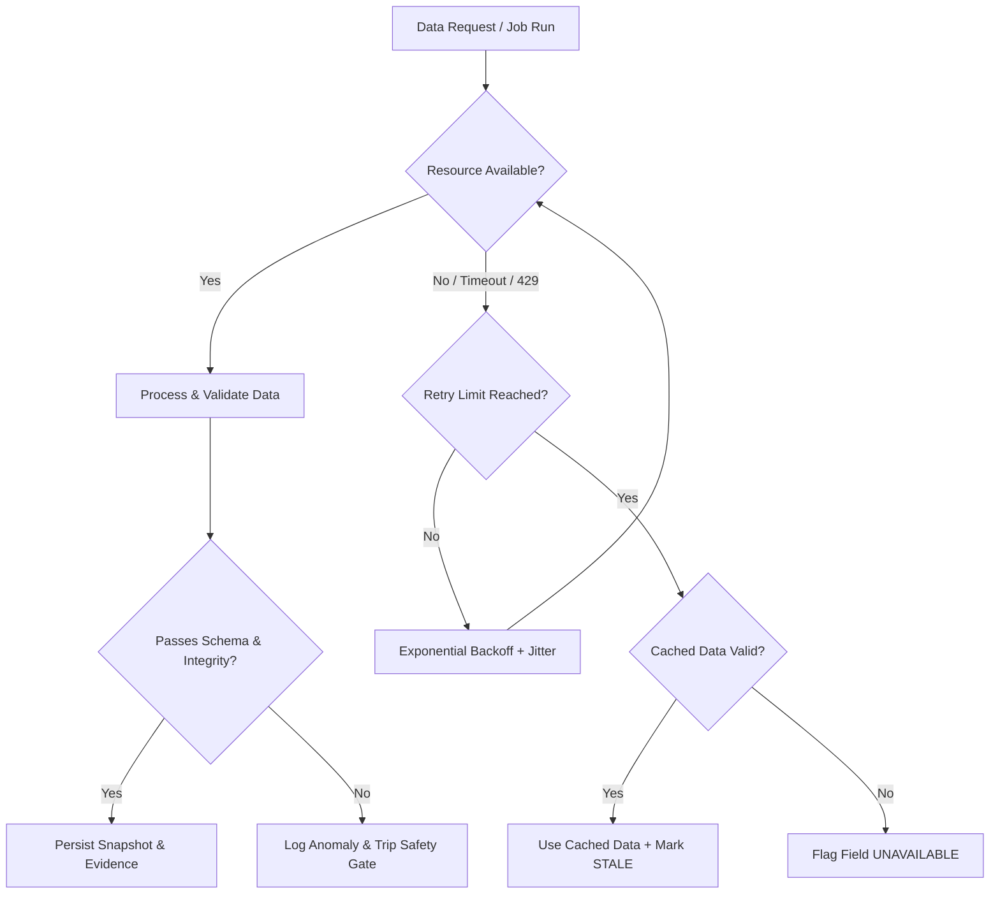

# Indian IPO Intelligence, Analysis, Recommendation, and Notification System
## System Architecture & Technical Design Specification

---

## 1. System Architecture

The system is designed as an evidence-driven, deterministic intelligence pipeline for discovering, analyzing, recommending, and alerting on Indian Initial Public Offerings (IPOs). 

### Core Architectural Principles
1. **Separation of Concerns**: Strictly isolated layers for ingestion, verification, deterministic math, forensic analysis, scoring, reporting, and notification delivery.
2. **Deterministic Primacy**: All financial and valuation calculations (CAGRs, multiples, margins, dilution, listing gains, subscription rates) are computed programmatically via deterministic code. The LLM is NEVER used for critical math.
3. **Evidence Provenance & Immutability**: Every factual statement is tied to a specific source record (document version, page number, extraction timestamp, confidence level).
4. **Hard Assessment Safety Gates**: If critical financial or timeline data is missing or contradictory, the system refuses to issue a speculative recommendation and outputs `⚪ UNABLE TO ASSESS`.
5. **Zero Mandatory Infrastructure Cost**: Operates cleanly in local environments, via cron jobs, or on GitHub Actions with zero mandatory recurring costs.
6. **Multi-Horizon Decision Modeling**: Separates overall Company Quality from IPO Price Attractiveness, Short-Term Listing Gain Opportunity, and Long-Term Horizon Opportunity.

---

## 2. Component Diagram



---

## 3. Data-Flow Diagram



---

## 4. Database Architecture

The relational schema is normalized into 24 core tables to ensure complete auditability, immutability of historical records, and provenance traceability.



### Table Definitions
1. **`ipos`**: Core entity (Symbol, Company Name, Industry, Issue Type, Exchange, Status, Announced/Verified Dates, Price Band, Lot Size, Issue Size, Fresh Issue, OFS).
2. **`ipo_events`**: Persistent lifecycle state transitions with IST timestamps and trigger origins.
3. **`ipo_documents`**: Registered filings (DRHP, RHP, Addenda, Price Band Ads).
4. **`document_versions`**: Document version history, SHA256 hashes, page count, and download locations.
5. **`sources`**: Authoritative and secondary sources with tier classifications and confidence scores.
6. **`facts`**: Atomic verified facts with source URL, doc ID, version, page number, and verification status.
7. **`calculations`**: Deterministic derived values with explicit calculation formula references.
8. **`financial_periods`**: Reporting periods (e.g. FY22, FY23, FY24, FY25, H1-FY26).
9. **`financial_metrics`**: Standardized metrics (Revenue, EBITDA, PAT, EPS, CFO, FCF, Net Debt, Net Worth, ROCE, ROE).
10. **`peers`**: Selected comparable companies with selection rationale and similarity scores.
11. **`peer_metrics`**: Valuation and operational metrics for peers.
12. **`risks`**: Quantified risks (Probability, Impact, Severity, Forensic citation).
13. **`valuations`**: Valuation calculations (Post-IPO Market Cap, EV, Multiples, Dilution, Dis/Prem vs Peers).
14. **`gmp_snapshots`**: Time-series GMP records, change rate, volatility, and calculated listing gain estimate.
15. **`subscription_snapshots`**: Category-wise subscription numbers across Day 1, 2, and 3.
16. **`anchor_investors`**: Anchor book allocations, institutional quality classification, and lock-in terms.
17. **`analysis_runs`**: Executed analysis job records, engine version, configuration hashes.
18. **`analysis_snapshots`**: Immutable point-in-time state of all metrics, scores, and signals.
19. **`recommendations`**: Stored ratings (Company Quality, IPO Attractiveness, Listing Opportunity, Long-Term Opportunity).
20. **`recommendation_reasons`**: Structured pros, cons, catalysts, and safety gate triggers.
21. **`alerts`**: Scheduled alert events (T-2, 6-hr, T-1, IPO Opened).
22. **`notifications`**: Dispatched messages across channels (WhatsApp, Email, SMS, Webhook).
23. **`notification_attempts`**: Granular transmission attempts, delivery receipts, errors, and retry counts.
24. **`youtube_videos`**: Sourced analysis videos with channel metadata, view counts, and relevance scores.
25. **`performance_outcomes`**: Post-listing actuals (Listing price, Listing day gain, 30D/90D/1Y returns) for feedback calibration.
26. **`audit_log`** & **`system_events`**: Complete operational telemetry and diagnostic logs.

---

## 5. IPO Lifecycle State Machine

```mermaid
stateDiagram-v2
    [*] --> IPO_DISCOVERED: Discovery from Tier 1/2 sources
    IPO_DISCOVERED --> IPO_DATE_IDENTIFIED: Dates announced
    IPO_DATE_IDENTIFIED --> IPO_DATA_COLLECTING: Ingestion triggered
    IPO_DATA_COLLECTING --> DOCUMENTS_AVAILABLE: DRHP/RHP ingested & hashed
    DOCUMENTS_AVAILABLE --> ANALYSIS_IN_PROGRESS: Forensic engine started
    ANALYSIS_IN_PROGRESS --> ANALYSIS_VALIDATED: Calculations & Safety Gates verified
    ANALYSIS_VALIDATED --> ALERT_SCHEDULED: Target T-2 alert scheduled
    ALERT_SCHEDULED --> T_MINUS_2_ALERT_SENT: T-2 alert dispatched
    T_MINUS_2_ALERT_SENT --> SIX_HOUR_REMINDER_SENT: 6 hours post T-2 alert
    SIX_HOUR_REMINDER_SENT --> T_MINUS_1_REMINDER_SENT: 1 day before opening
    T_MINUS_1_REMINDER_SENT --> IPO_OPENED: IPO opens for subscription
    IPO_OPENED --> SUBSCRIPTION_MONITORING: Day 1/2/3 subscription tracked
    SUBSCRIPTION_MONITORING --> IPO_CLOSED: IPO window closes
    IPO_CLOSED --> ALLOTMENT_MONITORING: Basis of allotment tracked
    ALLOTMENT_MONITORING --> LISTING: Trading begins on exchanges
    LISTING --> LISTING_DAY_ANALYSIS: Listing gain & accuracy evaluated
    LISTING_DAY_ANALYSIS --> POST_LISTING_30D: 30 days post-listing check
    POST_LISTING_30D --> POST_LISTING_90D: 90 days post-listing check
    POST_LISTING_90D --> POST_LISTING_1Y: 1 year post-listing check
    POST_LISTING_1Y --> PERFORMANCE_EVALUATED: Final calibration complete
    PERFORMANCE_EVALUATED --> [*]
```



---

## 6. Notification State Machine & Fallback Flow



---

## 7. Evidence & Provenance Architecture

Every analytical output strictly belongs to one of three classes:
- **FACT**: Directly sourced and referenced with document SHA256, page number, and publication timestamp.
- **CALCULATION**: Programmatically computed via deterministic code with traceable inputs and verified formulas.
- **OPINION**: Structured analytical interpretation (e.g. valuation multiple context, moat sustainability, risk assessment).

```mermaid
graph TD
    subgraph Evidence Store
        F[FACT: FY25 Revenue = ₹1,040 Cr<br/><i>Source: RHP Page 214</i>]
        F2[FACT: FY23 Revenue = ₹690 Cr<br/><i>Source: RHP Page 214</i>]
        F3[FACT: Pre-IPO Equity = 10 Cr shares<br/><i>Source: RHP Page 54</i>]
        F4[FACT: Fresh Issue = 2 Cr shares<br/><i>Source: RHP Page 54</i>]
    end

    subgraph Deterministic Calculations
        C1[CALCULATION: Revenue CAGR = 22.8%<br/><i>Formula: CAGR(690, 1040, 2)</i>]
        C2[CALCULATION: Post-IPO Equity = 12 Cr shares<br/><i>Formula: 10 + 2</i>]
    end

    subgraph Forensic Analysis
        A1[ANALYSIS: Strong sustained top-line momentum]
        A2[ANALYSIS: Moderate dilution (16.7%)]
    end

    subgraph Recommendation & Decision
        R[RECOMMENDATION: 🟢 ATTRACTIVE<br/><i>Confidence: HIGH | Gated: False</i>]
    end

    F & F2 --> C1 --> A1 --> R
    F3 & F4 --> C2 --> A2 --> R
```

---

## 8. Source-Priority & Conflict Resolution Architecture

Sources are categorized into three hierarchical tiers:
- **Tier 1 (Authoritative)**: SEBI, NSE, BSE, Official Company Investor Relations, RHP/DRHP Prospectuses.
- **Tier 2 (Reliable Secondary)**: Chittorgarh, IPOWatch, Screener, MoneyControl, Economic Times.
- **Tier 3 (Market Sentiment & Commentary)**: GMP Trackers, YouTube IPO Analysis, Community Discussions.

### Conflict Engine Rules
1. **Tier 1 Superiority**: If Tier 1 and Tier 2 differ (e.g. Opening Date on NSE vs Secondary portal), Tier 1 is automatically used.
2. **Material Discrepancy Logging**: Any difference between sources creates an explicit `SourceConflict` record.
3. **Safety Gate Downgrade**: If two Tier 1 sources disagree or critical fields have unresolved conflicts, the system immediately degrades the Confidence score and trips the assessment gate to `⚪ UNABLE TO ASSESS`.

---

## 9. Failure Handling & Resilience Architecture



---

## 10. Deployment Architecture

Designed for zero mandatory infrastructure cost with multiple deployment choices:

```mermaid
graph LR
    subgraph Local / Self-Hosted
        CLI_APP[Rich CLI Tool]
        WEB_APP[FastAPI & Web Dashboard]
        DB_SQLITE[(SQLite DB Storage)]
        SCHED[APScheduler Background Workers]
    end

    subgraph Automated Cloud (Zero-Cost)
        GHA[GitHub Actions Workflows]
        CRON[Cron Trigger: Hourly / Daily]
        REPORTS[Artifact / Telegram / Email / WhatsApp Output]
    end

    subgraph Serverless / Cloud Hosting
        RENDER[Render / Railway Free Tier]
        SUPABASE[(Supabase Free Postgres)]
    end

    CLI_APP & WEB_APP & SCHED --> DB_SQLITE
    GHA --> CRON --> CLI_APP --> REPORTS
    WEB_APP -.-> SUPABASE
```

---

## 11. Cost Architecture & Zero-Cost Strategy

| Component | Selected Strategy | Zero-Cost Free Tier Allowance | Hard Monthly Limit | Fallback Strategy |
| :--- | :--- | :--- | :--- | :--- |
| **Compute** | GitHub Actions / Local Engine | 2,000 mins/mo free on GHA | 500 mins/mo usage | Run locally via OS Task Scheduler / Cron |
| **Database** | Asynchronous SQLite / Supabase | Free local file / 500MB free Postgres | 50MB storage | Local SQLite with daily compressed backups |
| **Document Parser** | Local `pypdf` + `pdfplumber` | 100% Free Open Source | Unlimited local | Pure Python text extraction |
| **Email Delivery** | Standard SMTP (Gmail/Brevo/Resend) | 300 emails/day free on Brevo | 50 emails/mo usage | Console output + Local markdown export |
| **WhatsApp Delivery**| Meta Cloud API / Twilio Sandbox | 1,000 service convos/mo free | 100 alerts/mo usage | Automatic fallback to Email + Web Dashboard |
| **YouTube Research** | YouTube v3 Data API / Public feeds | 10,000 units/day free quota | 500 units/day usage | Scrape-free public RSS / Web Search fallback |
| **Market Data** | Public Exchange & Portal APIs | 100% Free Public Filings | Respectful rate limits | Polite throttling (2s delay + caching) |

---

## 12. Security & Compliance Architecture

1. **Zero Secret Leakage**: All credentials (API tokens, SMTP passwords, database keys) are managed strictly via environment variables loaded through `Pydantic Settings`. `.env.example` provides documentation templates; `.env` is permanently `.gitignore`d.
2. **Log Redaction**: Structured logging sanitizes error messages, tokens, and authorization headers before outputting to logs.
3. **Data Privacy**: No investor personal identification data or trading account credentials are ever ingested, processed, or stored.
4. **Scraping Compliance**: All web clients send polite custom `User-Agent` headers, adhere to robots.txt conventions, implement exponential backoff on HTTP 429, and cache documents locally by SHA256 hash to eliminate redundant external requests.
5. **Read-Only / Decision-Support Nature**: The system provides pure intelligence, analytics, and notification dispatch, containing zero trading execution or financial transaction interfaces.
